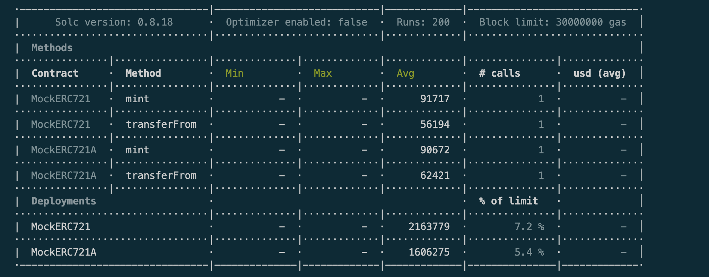
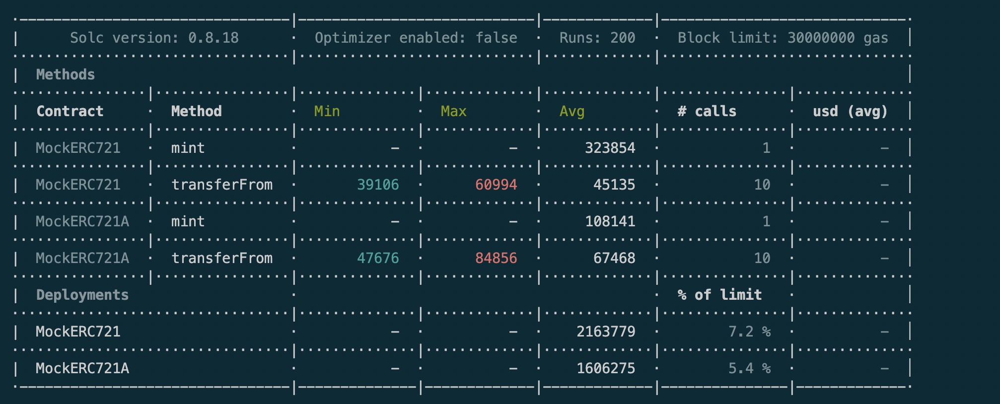
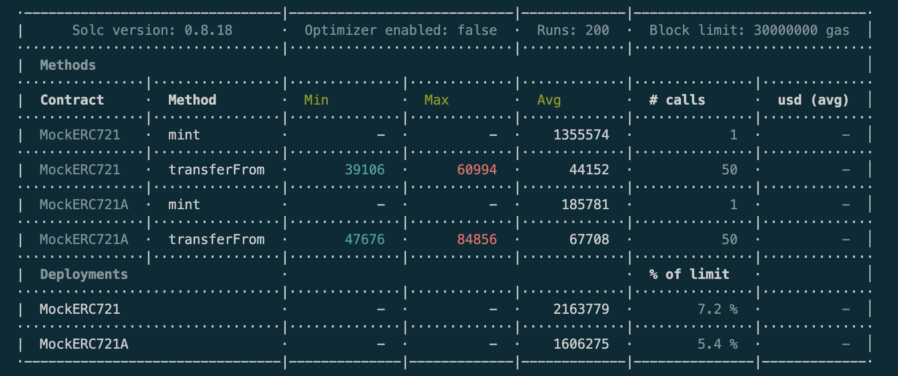
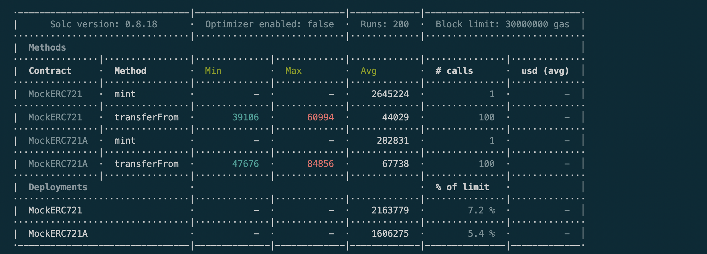

# ERC721A vs ERC721

## Myth

**We assume that ERC721A is always better for minting NFTs than simple ERC721.**

_Note - We won't be comparing ERC721A vs ERC721Enumerable simply because of difference in functionality provided between the two contracts._

## Hypothesis

Gas cost isn't simply being erased by the usage of ERC721A, instead it's likely being moved to another step of an NFT's lifecycle, which to my understanding is "Transfer" method.

## Method

1. We start off with basic ERC721 and ERC721A contracts with equally optimised mint functions.
2. We note gas requirements for both and then perform transfer operations on both.
3. We calculate net gas required for Mint and Transfer of NFTs

## Data

### Amount minted = 1

Total gas for ERC721 = 147,911 
Total gas for ERC721A = 153,093

### Amount minted = 10

Total gas for ERC721 = 775,204 
Total gas for ERC721A = 782,821

### Amount minted = 50

Total gas for ERC721 = 3,563,174 
Total gas for ERC721A = 3,571,181

### Amount minted = 100

Total gas for ERC721 = 7,048,124 
Total gas for ERC721A = 7,056,631

---

## Verdict

ERC721A vs ERC721 have almost the same gas cost for mint and transfer cycles and ERC721 provides additional benefits like minting exact token IDs as opposed to only being able to mint serialised tokens in ERC721A.

Therefore, ERC721A is not ALWAYS better than ERC721.

**MYTH BUSTED**
